# 🪵 Log Ingestion System

A full-stack, containerized log ingestion and query platform built with Next.js, Node.js, MongoDB, and Redis.

## 🏗️ System Architecture

This diagram illustrates the high-level architecture of the system, including the interaction between the Frontend, Backend, Database, and Cache components.

```mermaid
graph TD
    %% Styling
    classDef client fill:#f9f,stroke:#333,stroke-width:2px;
    classDef frontend fill:#aff,stroke:#333,stroke-width:2px;
    classDef backend fill:#ffa,stroke:#333,stroke-width:2px;
    classDef db fill:#bfb,stroke:#333,stroke-width:2px;

    %% Nodes
    User([👤 User / Browser])
    Postman([🚀 Postman / External Client])
    
    subgraph "Application Cluster"
        Frontend[🖥️ Next.js Frontend\n(Port 3001)]
        Backend[⚙️ Express Backend API\n(Port 3000)]
    end

    subgraph "Data Persistence & Caching"
        Redis[(⚡ Redis Cache)]
        Mongo[(🍃 MongoDB Atlas)]
    end

    %% Connections
    User -->|Interacts Loop| Frontend
    Frontend -->|API Requests (HTTP)| Backend
    Postman -->|Direct API Calls| Backend
    Backend -->|Cache Hit/Miss| Redis
    Backend -->|Read/Write Logs| Mongo

    %% Apply Styles
    class User,Postman client;
    class Frontend frontend;
    class Backend backend;
    class Redis,Mongo db;
```

## 🚀 CI/CD Pipeline

The project uses GitHub Actions for automated building, testing, and deployment.

```mermaid
flowchart LR
    Push[💻 Git Push] -->|Trigger| GH(🐙 GitHub Actions)
    
    subgraph "CI Pipeline"
        GH --> Build[🔨 Build Docker Images]
        Build -->|Tag with SHA| Images[📦 Docker Images]
    end
    
    subgraph "CD Pipeline"
        Images --> PushHub[☁️ Push to Docker Hub]
        PushHub -->|Update Manifests| K8s[HW Kubernetes Cluster]
    end

    style K8s fill:#326ce5,stroke:#fff,stroke-width:2px,color:#fff
```



## 🛠️ Tech Stack

-   **Frontend:** Next.js (React), Tailwind CSS, Axios
-   **Backend:** Node.js, Express.js
-   **Database:** MongoDB Atlas (Mongoose)
-   **Cache:** Redis
-   **DevOps:** Docker, Docker Compose, Kubernetes, GitHub Actions

## 🏃 Getting Started

### Prerequisites

-   Docker & Docker Compose
-   Node.js (v20+)

### Run Locally

```bash
# 1. Clone the repository
git clone <your-repo-url>

# 2. Create .env file (see .env.example)

# 3. Start the stack
docker compose up --build -d
```

-   **Frontend:** [http://localhost:3001](http://localhost:3001)
-   **Backend:** [http://localhost:3000](http://localhost:3000)
